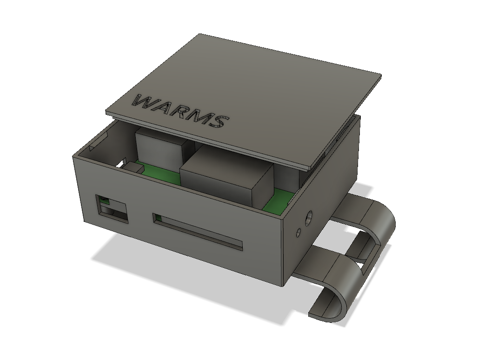
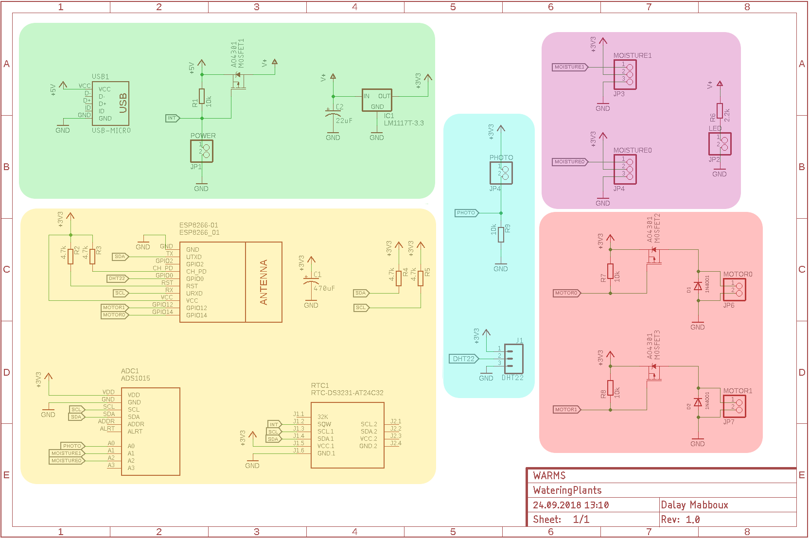

# WARMS
> Automatic plant watering with remote control and luminance, temperature and humidity data logging

Measures the moisture levels with two sensors and waters the plants individually.
The values are transmitted by MQTT and evaluated by Node-RED, if the moisture level is too low the ESP8266 will be instructed to switch on the micro water pumps.

<iframe id="ytplayer" type="text/html" width="320"
  src="https://www.youtube.com/embed/PIqeCujVt_k?autoplay=1&origin=https://github.com/DalayMabboux/WARMS" frameborder="0"></iframe>

## Overview
The whole installation consists of the following parts:
* A Raspberry PI running Mosquitto (MQTT server) and Node-RED
* A sensor box made up from a ESP8266, some sensors, micro pumps, etc.

## Raspberry PI
### SSL certificate
As the sensor data and the modification of the watering trigger value should easily be changeable, the Node-RED UI will be reachable over the Internet.
And secure it accordingly we'll enable HTTPS.
With the free service from [Let’s Encrypt](https://letsencrypt.org/) this is an easy task.
1) Get a certificate for madalito.internet-box.ch: `sudo certbot certonly --standalone --preferred-challenges http-01 -d madalito.internet-box.ch`
   * Hint: Create a cron job trying every hour to get a certificate
   
1) Also add a cron job to renew the certificate: `0 3 * * 6 certbot renew --noninteractive --standalone --post-hook "systemctl restart mosquitto"`

See [here](https://www.digitalocean.com/community/tutorials/how-to-install-and-secure-the-mosquitto-mqtt-messaging-broker-on-ubuntu-16-04) for a good info page.

### Node-RED
1) Follow the installation instruction on the [Node-RED site (Raspberry PI)](https://nodered.org/docs/hardware/raspberrypi).
1) Install [node-red-dashboard](https://github.com/node-red/node-red-dashboard)
1) Copy / Paste this node (todo: link file)

todo: add screenshots (config / dashboard)

### Mosquitto
1) Install mosquitto
1) Configure mosquitto:
   - Don't allow anonymous access
   - Specify the location of the SSL certificate
   - ... see todo
1) Restart: `sudo systemctl restart mosquitto`

## Sensor box

### Printed circuit
For the first prototype I used an `Arduino Nano` and an ESP8266 to connect to the Internet. The Arduino was wired to the ESP8266 by a software serial connection. I wasn't able to build a reliable link between the two. So I dropped the Arduino an used just the ESP8266. The only issue with this approach was, that the ESP8266 (ESP-01) didn't have enough IO ports (one less I needed) available.
Fortunately there is a [solution](https://www.instructables.com/id/More-GPIO-for-ESP8266-01/) to this problem :)

#### Schema
The schema may be grouped into these sections:
Color | Section | Remark
--- | --- | ---
Green | Power supply | USB connector, 5V to 3.3V converter and switching circuit
Yellow | Micro-controller and sensor circuits | 
Blue | Sensor connectors | Moisture, luminance, etc
Purple | Green power led | Switches on once the device is running
Red | Water pump driver |

> The device will be powered off until the DS3231 switches SQW low (interrupt output). This happens when a set alarm occurs (currently it is set to 30min).
> If `INT` is low then VGS will be greater than VGS threshold and the P-Channel MOSFET turns on. Then the voltage on V+ will be ~5V and with LM 1117T-3.3 will output 3.3V. The ESP8266 boots and starts the sketch (todo: see).

##### Power supply (green)

## Meta

Your Name – [@YourTwitter](https://twitter.com/dbader_org) – YourEmail@example.com

Distributed under the XYZ license. See ``LICENSE`` for more information.

[https://github.com/yourname/github-link](https://github.com/dbader/)

<!-- Markdown link & img dfn's -->
[npm-image]: https://img.shields.io/npm/v/datadog-metrics.svg?style=flat-square
[npm-url]: https://npmjs.org/package/datadog-metrics
[npm-downloads]: https://img.shields.io/npm/dm/datadog-metrics.svg?style=flat-square
[travis-image]: https://img.shields.io/travis/dbader/node-datadog-metrics/master.svg?style=flat-square
[travis-url]: https://travis-ci.org/dbader/node-datadog-metrics
[wiki]: https://github.com/yourname/yourproject/wiki
