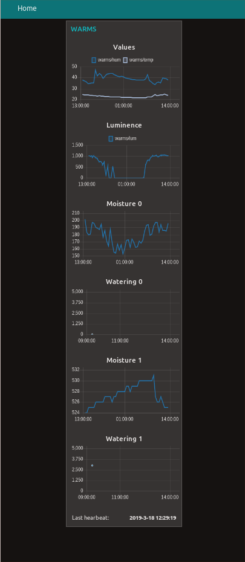

# WARMS
> Automatic plant watering with remote control and luminance, temperature and humidity data logging

Measures the moisture levels with two sensors and waters the plants individually.
The values are transmitted from the ESP8266 over MQTT to Node-RED, If the moisture level is too low the ESP8266 will be instructed to switch on the micro water pumps.

## Overview
The whole installation consists of the following parts:
1. A Raspberry PI running Mosquitto (MQTT server) and Node-RED
2. A sensor box made up from a ESP8266, some sensors, micro pumps, etc.
3. A cloud based (GKE Google Kubernetes Engin) watchdog. If the cloud 'alive' doesn't get a callback from Node-RED, then an email will be sent . If the cloud 'alive' doesn't get a callback from Node-RED, then an email ("Alert, no heartbeat recevied from WARMS") will be sent.

## Raspberry PI
### SSL certificate
As the sensor data and the modification of the watering trigger value should easily be changeable, the Node-RED UI will be reachable over the Internet.
And secure it accordingly we'll enable HTTPS.
With the free service from [Let’s Encrypt](https://letsencrypt.org/) this is an easy task.
1) Get a certificate for madalito.internet-box.ch: `sudo certbot certonly --standalone --preferred-challenges http-01 -d madalito.internet-box.ch`
   * Hint: Create a cron job trying every hour to get a certificate
   
1) Also add a cron job to renew the certificate: `0 3 * * 6 certbot renew --noninteractive --standalone --post-hook "systemctl restart mosquitto"`

See [here](https://www.digitalocean.com/community/tutorials/how-to-install-and-secure-the-mosquitto-mqtt-messaging-broker-on-ubuntu-16-04) for a good info page.

### Node-RED
1) Follow the installation instruction on the [Node-RED site (Raspberry PI)](https://nodered.org/docs/hardware/raspberrypi).
1) Install [node-red-dashboard](https://github.com/node-red/node-red-dashboard)
1) Copy / paste [this](code/NodeRED.json)

#### Dashboard

### Mosquitto
1) Install mosquitto
1) Configure mosquitto:
   - Don't allow anonymous access
   - Specify the location of the SSL certificate
   - Configuration: [default.conf](code/default.conf) [mosquitto.conf](code/mosquitto.conf)
1) Restart: `sudo systemctl restart mosquitto`

## Sensor box

### Printed circuit
For the first prototype I used an `Arduino Nano` and an ESP8266 to connect to the Internet. The Arduino was wired to the ESP8266 by a software serial connection. I wasn't able to build a reliable link between the two. So I dropped the Arduino an used just the ESP8266. The only issue with this approach was, that the ESP8266 (ESP-01) didn't have enough IO ports (one less I needed) available.
Fortunately there is a [solution](https://www.instructables.com/id/More-GPIO-for-ESP8266-01/) to this problem :)

[JLCPCB](https://jlcpcb.com) printed 10 of them for 2$ (exclusive shipping costs).

#### Schema
The schema has been drawn in [Autodesk EAGLE](https://www.autodesk.com/products/eagle/overview).

It is grouped into these sectios:
Color | Section | Remark
--- | --- | ---
Green | Power supply | USB connector, 5V to 3.3V converter and switching circuit
Yellow | Micro-controller and sensor circuits | 
Blue | Sensor connectors | Moisture, luminance, etc
Purple | Green power led | Switches on once the device is running
Red | Water pump driver |

> The device will be powered off until the DS3231 switches SQW low (interrupt output). This happens when a set alarm occurs (currently it is set to 30min).
> If `INT` is low then VGS will be greater than VGS threshold and the P-Channel MOSFET turns on. Then the voltage on V+ will be ~5V and with LM 1117T-3.3 will output 3.3V. The ESP8266 boots and starts the sketch (todo: see).

##### Power supply (green)
Most of the functionality has already been described in the paragraph above.

The POWER jumper JP1 is used to manually boot the device. Needed, when you first start the board (as no alarm is set at this time).

##### Micro controller and sensor circuits (yellow)
The Real-Time-Clock (RTC-DS3231) and the Analog-to-Digital converter (ADS1015) are connected to the ESP8266 by I2C.

C1 is used as decoupling capacitor (I really had weird phenomenon without it).

As the ESP8266-01 just has 2 GPIO's (GPIO 0 and GPIO 2) and these have special purpose functionality while the the micro controller starts. I decided to wire out GPIO 12 and GPIO 14 to get some extra unused pins. If I didn't already have these boards I would by another version of the ESP8266 (ex. ESP-07) to circumvent the tinkering / soldering (see [here](https://www.instructables.com/id/More-GPIO-for-ESP8266-01/) how to do it).

The WARMS board just uses 3 (A0 to A3) of the 4 AD inputs of the ADS1015.

##### Water pump driver (red)
MOTOR0 and MOTOR1 will be set to GND to switch on the P-channel MOSFETS.

The diodes (D1 and D2) are just Flyback-Diodes.

#### Arduino sketch
The sketch first sets all parts up (I2C, RTC, Wifi, MQTT, IN-OUTPUT). Then the main loop starts by connecting to MQTT (subscribe for PUMP and SLEEP messages). The SLEEP functionallity hasn't yet been implemented.
Once all is set up, then it starts transmitting the luminence, moisture 1 and 2, humidity and temparture.

### 3D printed parts
All parts have been drawn with [Autodesk Fusion 360](https://www.autodesk.com/products/fusion-360/overview).
The Fusion Archive file can be found [here](code/WARMS_Box.f3d).

## Meta
Dalay Mabboux – [@mabbouxd](https://twitter.com/mabbouxd)

WARMS is licensed under a
Creative Commons Attribution-ShareAlike 4.0 International License.

You should have received a copy of the license along with this
work. If not, see <http://creativecommons.org/licenses/by-sa/4.0/>.
